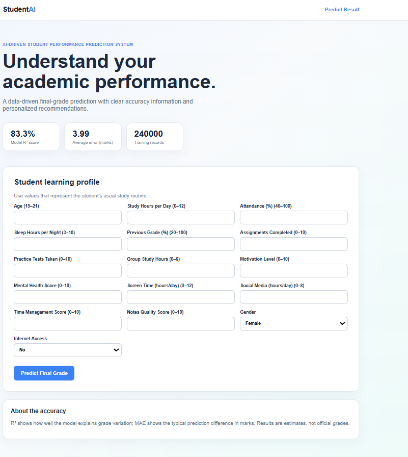
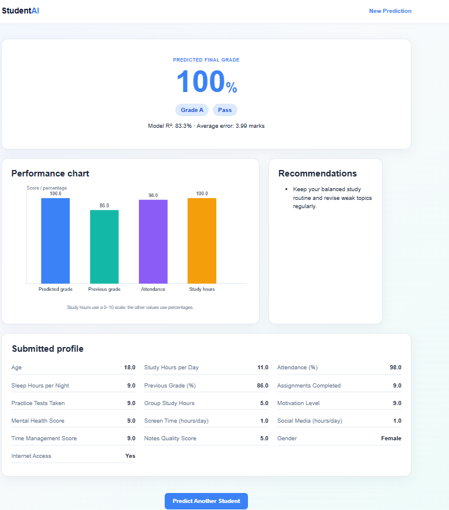

<h1 align="center">🎓 AI-Driven Student Performance Prediction System</h1>

<p align="center">
  Predict student academic performance using Machine Learning and Flask.
</p>

<p align="center">
  
  
  
  
  
</p>

---

## 📖 About

This project is a **Flask-based Machine Learning web application** that predicts a student's final academic grade using study habits, attendance, previous performance, and other academic factors.

The application also provides personalized recommendations to help students improve their performance.

---

## ✨ Features

- 🎯 Predict final student grades
- 🤖 Machine Learning-based prediction
- 📊 Interactive performance chart
- 💡 Personalized recommendations
- 📈 Displays R² Score and MAE
- 🌐 Responsive web interface

## 📂 Project Structure

```text
📦 Student-Performance-Prediction
├── 📁 dataset
├── 📁 models
├── 📁 src
├── 📁 static
├── 📁 templates
├── app.py
├── requirements.txt
└── README.md
```

---

## 🚀 Installation


```bat
python -m venv .venv
.venv\Scripts\activate
pip install -r requirements.txt
python src\train.py
python app.py
```


Visit:

```
http://127.0.0.1:5000
```

---

## 📸 Screenshots

### 🏠 Home Page

>  

### 📊 Prediction Result

> 

---

## 🔮 Future Enhancements

- 🔐 User Authentication
- ☁️ Cloud Deployment
- 📄 PDF Report Generation
- 📈 Advanced ML Models
- 📊 Prediction History

---

## 👨‍💻 Author

**Vikash Kushwaha**

⭐ If you found this project useful, consider giving it a **Star** on GitHub!


